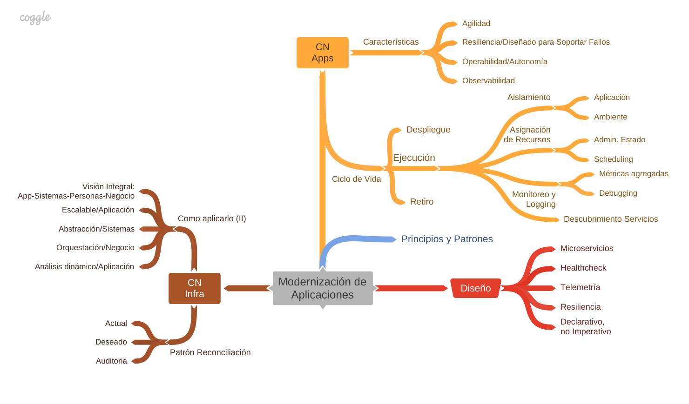

# expanddevopsview2022
Presentacion y Codigo de "Expand your DevOps View For 2022"  - Sección "Cloud Native Approach using Oracle Functions" - 13 Enero/2022.

Autor: Francisco Javier Moreno - fmorenod@gmail.com

**Secciones**

Esta dividido en:

- **[Code](code/README.md):** Codigo de Laboratorio, incluido el entorno de prueba tomado del ejemplo de Pluralsigth, https://app.pluralsight.com/library/courses/serverless-programming-fn-project
- **[Mindmaps](Mindmaps.md):** Mapas mentales personales de la presentación y secciones de la misma.
- **[Referencias](References.md):** Enlaces y referencias.

General Agenda de la presentacion

Presentacion
