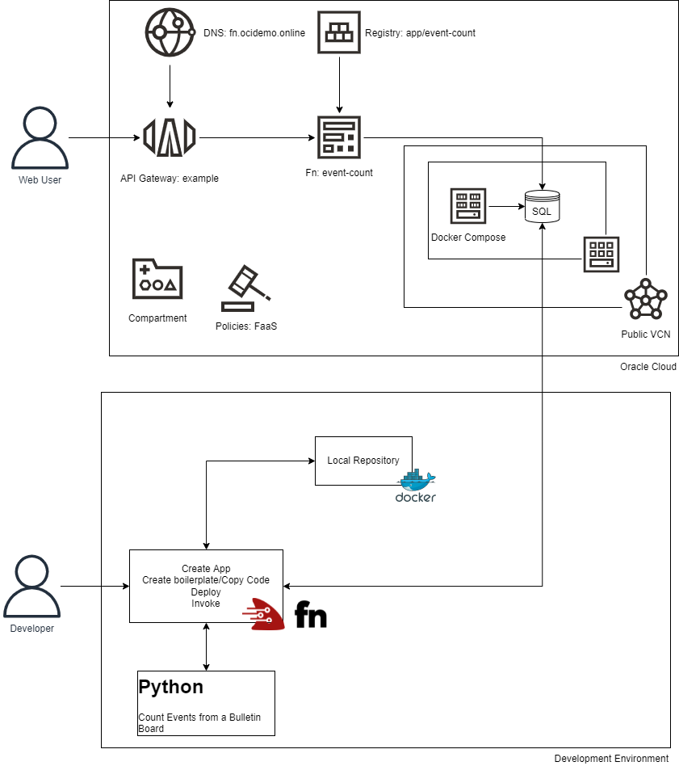

# expanddevopsview2022
Presentacion y Codigo de "Expand your DevOps View For 2022"  - Sección "Cloud Native Approach using Oracle Functions" - 13 Enero/2022.

Autor: Francisco Javier Moreno - fmorenod@gmail.com

**Descripcion**
Se realiza una consulta SQL compartida para obtener la cantidad de eventos publicados en la pagina web.
Se realiza usando Python 3.6 

- **[Prerequisitos]: 
- Docker, si esta en Windows se recomienda ejecutar el WSL2 y Docker Desktop, luego *TODOS* * los comandos se ejecutaran en la distribucion Linux en el WSL2.
- Fn Server, instalar segun https://github.com/fnproject/tutorials/blob/master/install/README.md
- Crear una cuenta OCI Free Tier en https://www.oracle.com/cloud/free/
- Instalar el OCI CLI en WSL2.

Pasos:
- C

Simple Lab using Oracle Functions

